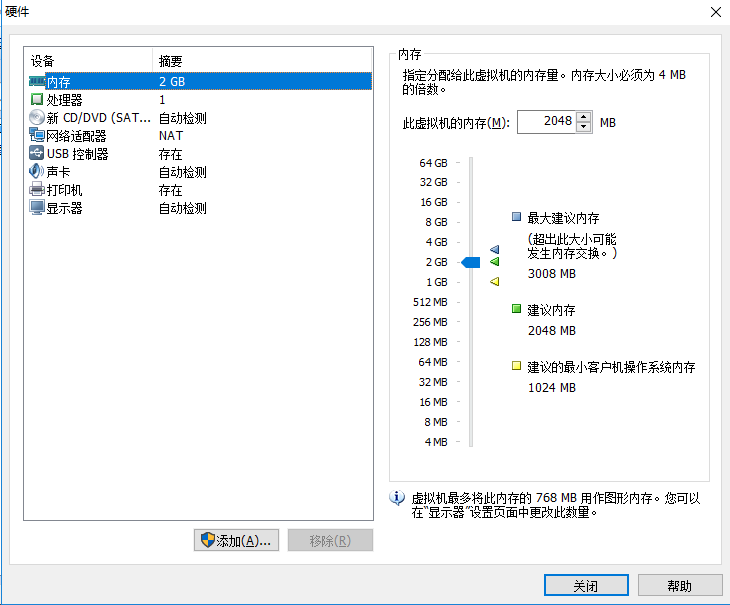
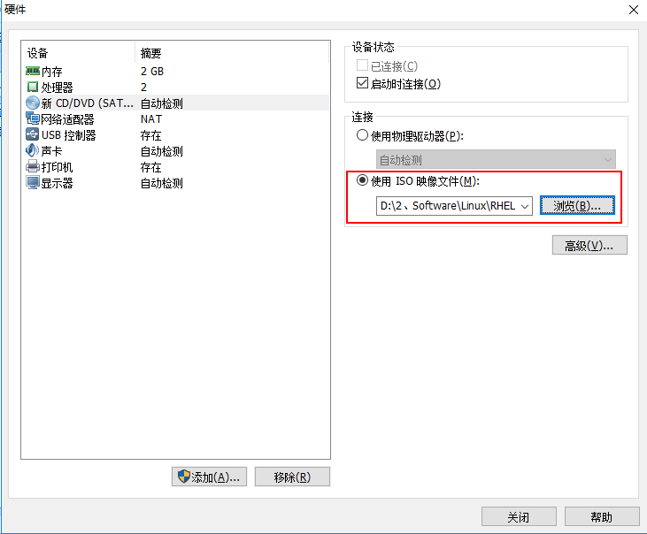
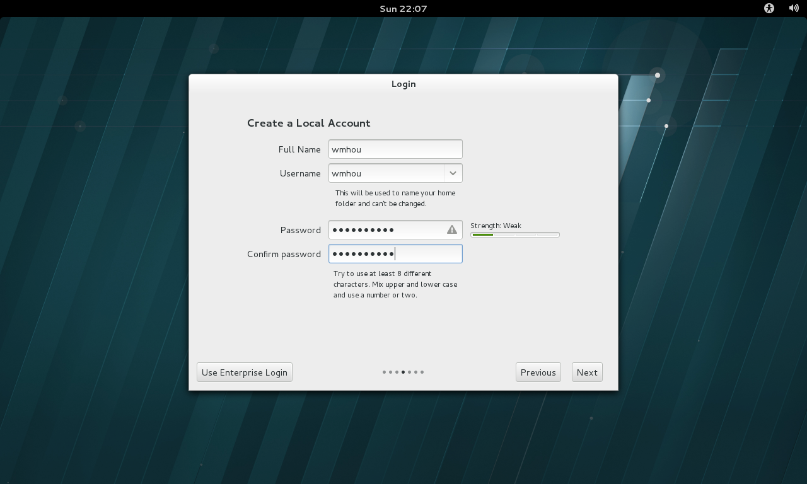

### 1、虚拟机安装和Linux系统部署

[上篇：Chapter1：1、什么是Linux](1、什么是Linux.md)

来，我们直接上手，既然Linux系统是一种操作系统，那么我们就要给它安装在电脑上，怎么安装呢？最基本的有三种方式：

- 第一种简单粗暴，直接用Linux系统覆盖掉现有的Windows系统，这样你的系统就是Linux系统了，如果是刚开始学习，建议不要这样搞，安装Linux简单，但是如果想像用Windows那样去操作你的机器，你就该后悔了；
- 第二种，双系统，就是说Windows和Linux共存，通过BOIS设置，开机选择进入某一个系统，这个方式也很方便，需要单独给Linux系统一个分区，但是这种方式将你的系统独立开来，交互怕是不方便了；
- 第三种，也就是我们的专题主推的方式，虚拟机安装，用SSH客户端建立连接，因为是虚拟机，你可以去体验各种发行版本的Linux，坏了大不了重新安装一个，贼简单了。

#### 虚拟机软件安装和配置

笔者目前使用的Windows10系统，虚拟机使用Vmware Workstation，这是安装好的界面：

vm的安装是比较简单的，按照提示一直下一步就可以完成安装，不过还是建议把软件安装在D盘或者除C盘之外的盘下，不是怕安装在C盘会拖慢系统运行速度，主要是怕有一天要重新安装系统了，C盘下的软件和文档之类的东西会丢失，分门别类整理各类软件和文档，这是一个好习惯。

下面开始我们要配置一个可以安装Linux系统的虚拟机

1. 主页上点击“创建新的虚拟机”，选择“典型”，点击“下一步”；

   

2. 选择“稍后安装操作系统”，点击“下一步”；

   

3. 选择客户机操作系统：Linux，版本选择RedHet（红帽），也就是稍后要安装的系统，点击“下一步”；

   

4. 命名虚拟机：取一个你想要的名字，选择安装位置，照例不在C盘下，点击“下一步”；

   

5. 指定磁盘容量，这里默认20GB，可以自行更改，这里我们使用默认，点击“下一步”；

   

6. 完成创建前，列举了各项属性，点击“自定义硬件”；

   

7. 内存设置：还是根据真机进行设置，不需要要太大，但是也建议不要低于1GB；

   

8. 处理器：根据真机设置，同时开启虚拟化功能；

   

   这里补充一点小知识，关于查看系统CPU数量，核心数的操作：

   在cmd中输入命令“systeminfo”，Enter输出：

   

   可以看到处理器数量为1，还有其他详细信息，查看CPU数，核心数和线程数在cmd中输入命令“wmic”，然后在新窗口输入“cpu get * ”命令，Enter：

   

   Name：物理CPU；

   NumberOfCores：CPU核心数；

   NumberOfLogicalProcessors：CPU线程数；

   看得出来，我的电脑配置是：i5处理器双核四线程，老了老了，下面继续：

9. 光驱设备设置：这里选择使用ISO映像文件，选择已经下载的Redhat.iso的文件；

   

10. 网络适配器：这里选择“仅主机模式”，只与主机通信；

    

11. 移除“USB控制器”、“声卡”、“打印机”这三项，我们用不到；

    

12. 点击“关闭”，进入到设置向导界面，点击“完成”，现在主页就显示出了我们搭建好的虚拟机；

    

下面开始Linux系统的安装。

#### Linux系统安装

1. 在虚拟机管理界面点击“开启此虚拟机”，弹出RHEL7的安装界面，我们控制方向键选择第一项开始安装；

   

2. 加载镜像，请等待；

   

3. 选择系统的安装语言，我们默认，点击“continue”，补充一个小操作，如果要从虚拟机释放鼠标焦点，按“Ctrl+Alt”组合键即可释放鼠标；

   

4. 安装选项：在安装界面中选择SOFTWARE SELECTION选项，选择“Server with GUI”，左上角“done”退出；

   

   

5. 上面的安装界面中，SYSTEM下INSTALLATION DWSTINATION关于系统磁盘划分我们选择默认，后面会详细说，其他的选项可以默认，也可以自己设置，都是简单的英语，也没有特别重要的设置；

   

6. 点击“Begin installation”弹出如下界面，我们设置一下root用户的密码，需要输入一次、确认一次，完成的时候要点两下“done”按钮，然后就等待系统安装吧，时间不等，大概10~30min；

   

7. 安装完成，点击“Reboot”重启系统；

   

8. 重启完成后，弹出系统初始化界面，点击LICENSE INFORMATION选项；

   

9. 选中I accept…复选框，点击“done”按钮；

   

10. 返回初始化界面，点击FINISH CONFIGURATION按钮；

    

11. 弹出Kdump服务设置界面，点击forward按钮；

    

12. 弹出系统订阅界面，选择No…复选框，点击finish，再次重启系统。这几步操作中按照默认也可，后面我们的学习中会慢慢知道这些选项的作用；

    

13. 这里是系统的欢迎页面，选择语言，我们默认即可，点击next按钮；

    

14. 选择系统输入来源，继续默认English（US），点击next；

    

15. 创建一个普通用户，这里创建用户名为：wmhou，创建一个密码，点击next；

    

16. 选择系统时区，点击next；

    

17. 欢迎界面的设置已经完毕，弹出的界面中点击Start using Red Hat Enterprise Linux Server，完成了全部的安装工作；

    

18. 最终界面显示如下，开始我们的Linux之旅吧！

    