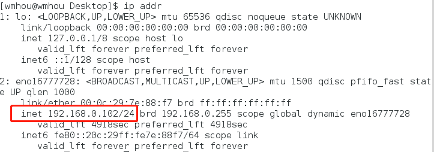
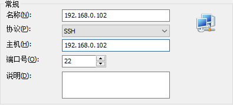
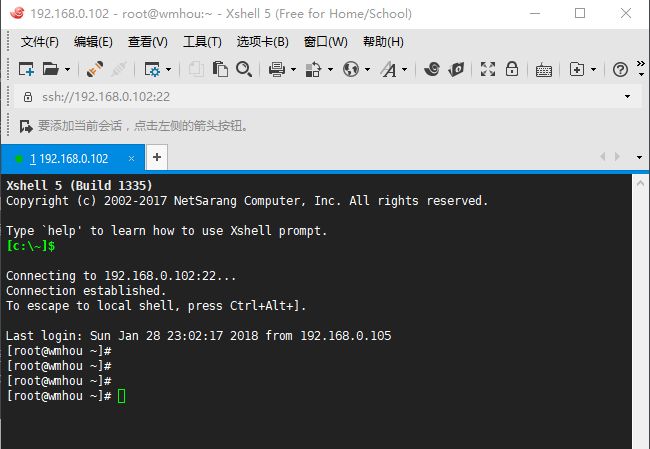

### 3、远程连接Linux服务器

[上篇——Chapter1：2、虚拟机安装和Linux系统部署](2、虚拟机安装和Linux系统部署.md)

为啥要远程连接？

Linux作为全球绝大多数服务器系统使用，常用的发行版有Redhat、CentOS等，因为服务器的部署都在各地机房，为了系统运行的速度和稳定性考虑，也不会提供什么图形界面。而且很少说会某个公司会搞一台电脑换个Linux系统去做服务器，而且经常会有多个用户操作同一台服务器，这样远程连接就很有必要了，我们学习Linux就是学习命令界面，那么先把远程连接用起来吧。

常用的远程连接客户端有Xshell、Putty等工具，这个专题我们使用Xshell，很强大的SSH工具。Xshell分商业版和社区版，社区版免费提供给个人用户使用，安装的时候可以自行选择需要的版本，安装很简单，类同于大部分windows软件，此处不再记录。

看一下如何使用xshell远程链接服务器：

既然要连接到服务器，得知道地址、用户名和密码这三项吧，用户名和密码我们之前安装RH的时候已经设置，地址，也就是虚拟机的IP，我们可以在虚拟机中打开终端，输入命令：ip addr进行查看：

三者具备，只欠Xshell，打开Xshell，弹出如图建立连接的界面，在主机中输入我们查看到的IP地址，SSH连接默认端口22，不用改动。

建立连接按照提示输入用户名和密码，登陆成功显示：

至此，我们可以用xshell管理远程服务器了，相当于在本地电脑上开了一个Linux的终端，可以在终端做的事，xshell也完全可以胜任，准备工作完成。下面，开始我们的Linux之旅吧。

[下篇：Chapter2：1、Linux命令格式和目录结构]()

