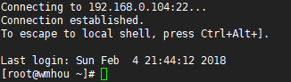
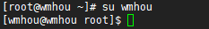

### 1、Linux命令格式和目录结构

#### 命令行提示符

我们第一次连接到Linux远程服务器，会出现类似于下图的一个显示界面，这个界面就代表我们已经成功登陆了远程：

上面三行的连接信息我们可以不看，下面一行显示最后登录日期，最重头戏的就是最后这一行，什么意思呢？而且在你输入的每一行命令前都会有这样的字符串，我们拆开说一下：

- root，当前用户的名字，Linux作为多用户操作系统，root类似于windows的Admin管理员账户，属于超级用户；
- @，这个符号类似于邮件中的at，这个符号前面表示用户，后面是所在位置；
- wmhou，这是当前操作系统的名字，代表当前电脑，这个名称可以任意指定；
- ~，这个符号代表当前用户的家目录；
- "#"，这个符号表示超级用户，也就是root；
- $，有超级用户就有普通用户，这个符号就代表了当前用户是普通用户；

因为我们用root登录的服务器，所以刚才显示的是root用户，如果要切换到普通用户，也就是我们安装系统时创建的wmhou用户，只需要输入一条命令：

```shell
su wmhou
```

切换后显示：

当前用户为wmhou，在名称为wmhou的计算机（域）中，家目录是root，权限是普通用户，这就是用户的切换，在Linux中从root用户切换到普通用户一般不需要输入密码，反过来却是必要的，这点很好理解，对root用户的操作，确实需要一定的保护。后面的操作中，我们尽量在普通用户权限下进行。

#### 命令和参数

Linux

